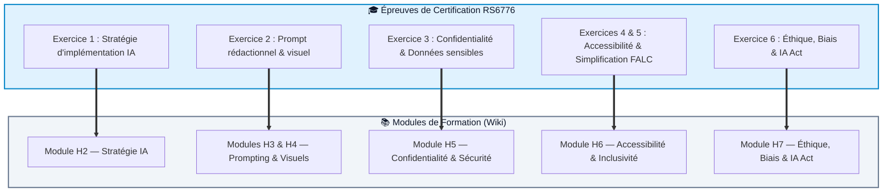

# Certification RS6776

Cette page vous aide à comprendre le lien direct entre la formation, le parcours du wiki et l'examen de certification **RS6776**.

La certification RS6776 valide votre capacité à utiliser l’intelligence artificielle générative pour créer des contenus rédactionnels et visuels de manière efficace, sécurisée, inclusive et conforme aux règles en vigueur.

  <h3>Source officielle France Compétences</h3>
  
Fiche officielle RS6776 : <a href="https://www.francecompetences.fr/recherche/rs/6776/" target="_blank" rel="noopener">Création de contenus rédactionnels et visuels par l’usage responsable de l’intelligence artificielle générative</a>

---

## Ce que la certification valide

La certification vérifie vos compétences opérationnelles en situation professionnelle.

Elle évalue notamment votre capacité à :

* **Choisir** les bons outils d'IA générative selon un besoin métier défini ;
* **Rédiger** des prompts structurés, précis et efficaces (méthodes CROFT, Few-Shot) ;
* **Produire** des contenus rédactionnels et visuels professionnels ;
* **Protéger** les données sensibles de votre organisation (RGPD, anonymisation) ;
* **Rendre** les contenus accessibles, lisibles et inclusifs (FALC, WCAG) ;
* **Détecter** les biais, stéréotypes, hallucinations et risques éthiques ;
* **Appliquer** les exigences réglementaires européennes (IA Act).

---

## Alignement : Exercices RS6776 & Modules de Formation

---

## Détail des 6 exercices de la certification

| Exercice | Objet d'évaluation | Module utile |
| :--- | :--- | :---: |
| **Exercice 1** | Stratégie d’implémentation et choix des outils d'IA | **[H2 — Stratégie](formation/h2.md)** |
| **Exercice 2** | Prompting rédactionnel (CROFT) et création de visuels | **[H3 — Prompt](formation/h3.md)** & **[H4 — Visuels](formation/h4.md)** |
| **Exercice 3** | Anonymisation et protection des données sensibles | **[H5 — Confidentialité](formation/h5.md)** |
| **Exercice 4** | Accessibilité numérique et inclusion des contenus | **[H6 — Accessibilité](formation/h6.md)** |
| **Exercice 5** | Simplification de texte et rédaction FALC | **[H6 — Accessibilité](formation/h6.md)** |
| **Exercice 6** | Audit éthique, détection des biais et conformité IA Act | **[H7 — Éthique](formation/h7.md)** |

---

## Checklist d'auto-évaluation RS6776

  <h3>📊 Auto-évaluez votre niveau de préparation</h3>
  
Cochez les compétences que vous maîtrisez déjà pour mesurer votre préparation à l'examen :

  

    <label style="display: flex; align-items: center; gap: 10px; cursor: pointer;">
      <input type="checkbox" class="rs-check-item" onchange="updateRs6776Score()" style="width: 18px; height: 18px;">
      <strong>Exercice 1 :</strong> Je sais choisir le LLM adapté à une problématique métier.
    </label>

    <label style="display: flex; align-items: center; gap: 10px; cursor: pointer;">
      <input type="checkbox" class="rs-check-item" onchange="updateRs6776Score()" style="width: 18px; height: 18px;">
      <strong>Exercice 2 :</strong> Je sais structurer un prompt complet (méthode CROFT) et générer une image ciblée.
    </label>

    <label style="display: flex; align-items: center; gap: 10px; cursor: pointer;">
      <input type="checkbox" class="rs-check-item" onchange="updateRs6776Score()" style="width: 18px; height: 18px;">
      <strong>Exercice 3 :</strong> Je sais identifier et anonymiser systématiquement les données sensibles (RGPD).
    </label>

    <label style="display: flex; align-items: center; gap: 10px; cursor: pointer;">
      <input type="checkbox" class="rs-check-item" onchange="updateRs6776Score()" style="width: 18px; height: 18px;">
      <strong>Exercice 4 :</strong> Je sais vérifier les critères d'accessibilité (alternative textuelle, lisibilité).
    </label>

    <label style="display: flex; align-items: center; gap: 10px; cursor: pointer;">
      <input type="checkbox" class="rs-check-item" onchange="updateRs6776Score()" style="width: 18px; height: 18px;">
      <strong>Exercice 5 :</strong> Je sais adapter et vulgariser un texte complexe en langage simple / FALC.
    </label>

    <label style="display: flex; align-items: center; gap: 10px; cursor: pointer;">
      <input type="checkbox" class="rs-check-item" onchange="updateRs6776Score()" style="width: 18px; height: 18px;">
      <strong>Exercice 6 :</strong> Je sais repérer un biais algorithmique et citer les principes de l'IA Act.
    </label>
  

  

    <strong>Progression : 0 / 6 compétences validées</strong>
    
Commencez par consulter le module H0 ou faites l'évaluation d'entrée.

  

---

## Les 6 réflexes du candidat

  

    
🎯

    <h3>1. Objectif</h3>
    
Définir le rôle, le livrable et la cible précise avant tout prompt.

  

  

    
📌

    <h3>2. Contexte</h3>
    
Fournir le contexte métier et les contraintes de format à l'IA.

  

  

    
🔒

    <h3>3. Sécurité</h3>
    
Purger toutes les données personnelles ou confidentielles avant envoi.

  

  

    
🔎

    <h3>4. Contrôle</h3>
    
Vérifier chaque fait, chiffre ou assertion générée (anti-hallucination).

  

  

    
👁️

    <h3>5. Accessibilité</h3>
    
Assurer la lisibilité, le contraste et les textes alternatifs visuels.

  

  

    
⚖️

    <h3>6. Éthique</h3>
    
Garantir l'absence de biais et la conformité à la réglementation.

  

---

## À retenir

  <h3>Le principe d'évaluation RS6776</h3>
  
L’évaluation n'évalue pas votre capacité à copier-coller du texte généré, mais votre <strong>posture critique</strong> : cadrer l'outil, sécuriser les flux de données, contrôler les livrables et adapter le résultat aux contraintes réglementaires.

---

## Suite du parcours

  <a class="wiki-button primary" href="evaluation-entree.md">Passer l'évaluation d'entrée</a>
  <a class="wiki-button" href="formation/h0.md">Démarrer le module H0</a>

