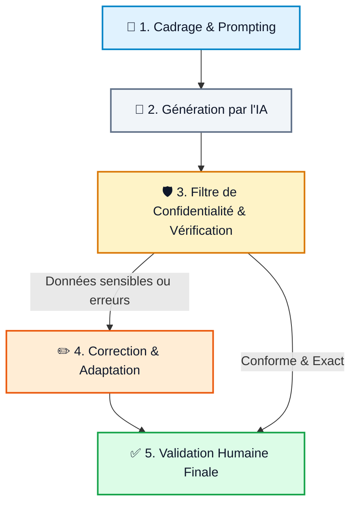

{ .home-hero-image }

# Wiki Formation IA générative

Bienvenue dans votre espace de ressources dédié à l’IA générative et à la préparation de la certification **RS6776** (*Utiliser des outils d'IA générative de manière sécurisée et responsable*).

Ce wiki complète les séances de formation : il vous permet de revoir les notions clés, de télécharger des méthodes éprouvées et d'appliquer l'IA dans vos cas métiers quotidiens.

---

## Commencer ici

  <a class="wiki-card" href="./certification-rs6776/" style="text-decoration: none; color: inherit;">
    
🎓

    <h3>Certification RS6776</h3>
    
Comprendre les objectifs, les compétences visées et le référentiel officiel.

  </a>

  <a class="wiki-card" href="./formation/h0/" style="text-decoration: none; color: inherit;">
    
🚀

    <h3>Démarrer la formation</h3>
    
Suivre le parcours guidé des séances H0 à H7 étape par étape.

  </a>

  <a class="wiki-card" href="./evaluation-entree/" style="text-decoration: none; color: inherit;">
    
📝

    <h3>Évaluation d’entrée</h3>
    
Faire le point sur vos connaissances initiales avant de vous lancer.

  </a>

  <a class="wiki-card" href="./prompt-croft/" style="text-decoration: none; color: inherit;">
    
🧩

    <h3>Templates pratiques</h3>
    
Copier des modèles de prompts (méthode CROFT) et checklists prêtes à l'emploi.

  </a>

---

## Les 4 Piliers de la Formation

  

    
🧠

    <h3>1. Prompting Structuré</h3>
    
Maîtriser la méthode CROFT, le Few-Shot et le Chain-of-Thought pour des réponses précises.

  

  

    
🛡️

    <h3>2. Sécurité & RGPD</h3>
    
Protéger les données d'entreprise et appliquer les techniques d'anonymisation systématiques.

  

  

    
⚖️

    <h3>3. Éthique & IA Act</h3>
    
Identifier les biais, respecter la propriété intellectuelle et se conformer au cadre européen.

  

  

    
🔍

    <h3>4. Contrôle Humain</h3>
    
Détecter les hallucinations et valider la fiabilité des productions générées.

  

---

## Le Processus d'Usage Responsable

---

## Le bon réflexe

  <h3>Dans la vraie vie</h3>
  
L’IA générative est un copilote, pas un pilote automatique.

  
Avant d’exploiter une réponse générée par l'IA, appliquez la règle des 5 piliers :

  <ul>
    <li><strong>Cadrer :</strong> Détailler le contexte et le rôle attendu.</li>
    <li><strong>Protéger :</strong> Supprimer tout nom, identifiant ou donnée sensible.</li>
    <li><strong>Vérifier :</strong> Recouper les faits, calculs et sources citées.</li>
    <li><strong>Adapter :</strong> Personnaliser le ton et le style au contexte métier.</li>
    <li><strong>Valider :</strong> Conserver la responsabilité finale du livrable.</li>
  </ul>

---

## Échauffement Express

  

    ⚡
    <h3 style="margin: 0;">Testez votre premier réflexe IA</h3>
  

  
  
<strong>Mise en situation :</strong> Vous devez rédiger un compte-rendu à partir d'un document interne contenant des données confidentielles. Quelle est la meilleure approche ?

  

    <button onclick="checkHeroQuiz(1)" class="home-button" style="text-align: left; cursor: pointer; width: 100%;">
      A. Copier-coller le document brut dans l'outil d'IA pour aller plus vite.
    </button>
    <button onclick="checkHeroQuiz(2)" class="home-button" style="text-align: left; cursor: pointer; width: 100%;">
      B. Anonymiser les données sensibles avant d'envoyer la demande à l'IA.
    </button>
    <button onclick="checkHeroQuiz(3)" class="home-button" style="text-align: left; cursor: pointer; width: 100%;">
      C. Demander à l'IA dans le prompt de promettre de ne pas enregistrer les données.
    </button>
  

  

---

## Accès rapide

  <a class="wiki-button primary" href="./formation/h0/">Commencer la formation</a>
  <a class="wiki-button" href="./evaluation-entree/">Faire l’évaluation d’entrée</a>
  <a class="wiki-button" href="./prompt-croft/">Voir les templates</a>

